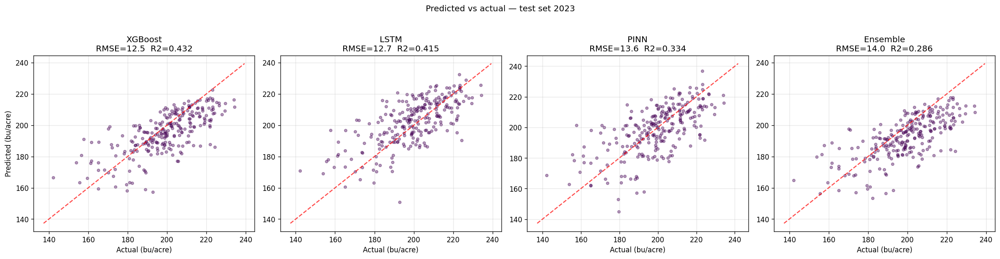
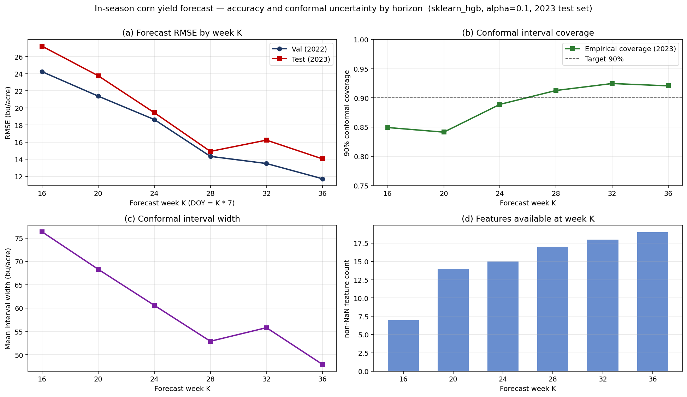
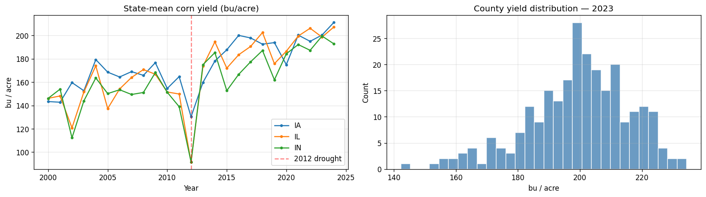
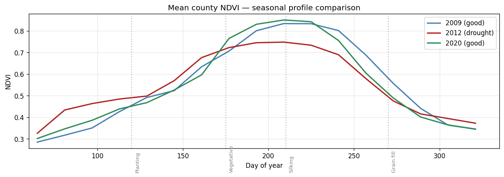
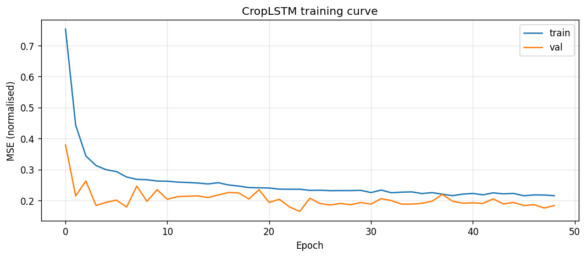
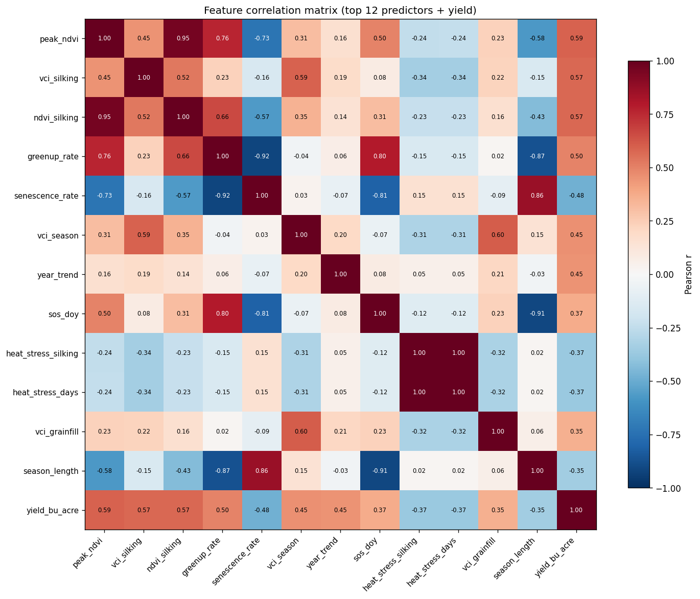

# 🌽 CropSight CornBelt

**End-to-end corn yield forecasting for the US Corn Belt using satellite remote sensing, reanalysis weather data, and physics-informed machine learning.**

[](https://python.org)
[](https://pytorch.org)
[](https://xgboost.readthedocs.io)
[](https://streamlit.io)
[](LICENSE)

---

## Overview

CropSight CornBelt is a multi-module geoscience ML system that predicts county-level corn yield across Iowa, Illinois, and Indiana using 24 years of satellite vegetation indices, reanalysis weather data, and soil properties. The system integrates physics-based crop growth knowledge directly into the machine learning pipeline - a physics-informed neural network (PINN) with a hybrid loss function that penalises agronomically implausible predictions.

This project is the second in a series of end-to-end atmospheric/geoscience ML systems, following [HyperWind-Now](https://github.com/Ibekwemmanuel7/hyperwind-now) (drone wind hazard forecasting). Both systems follow the same architectural philosophy: multi-module pipelines where domain physics constrain the ML, not just inform it.

**Key results on held-out test set (2023):**

| Model | RMSE (bu/acre) | MAE (bu/acre) | R² |
|-------|:--------------:|:-------------:|:---:|
| **XGBoost** (production) | **12.5** | 9.7 | 0.432 |
| **PINN** (physics-informed) | 13.6 | 10.7 | 0.334 |
| LSTM temporal | 12.7 | 10.1 | 0.415 |

> XGBoost RMSE of 12.5 bu/acre represents ~6% error on a ~200 bu/acre baseline - competitive with published academic benchmarks for county-level yield forecasting using satellite data alone, without in-season field surveys.

We ship **XGBoost + PINN as a calibrated pair**: XGBoost provides the headline point forecast and SHAP-based per-county explanation, and the PINN supplies the physics-constrained sanity check. An exploratory Ridge stacking ensemble was trained and discarded — it underperformed both base models (RMSE 14.0) because the base predictions were too correlated for the meta-learner to add value. The negative empirical result is documented in `module3_modeling.ipynb` for reproducibility.



---

## In-season forecasting (preview)

The full-season numbers above are a hindcast — produced after the season ends, using all 24 NDVI composites and full-season weather aggregates. The product extension is **in-season forecasting**: regenerate the forecast each week of the growing season using only data observable up to that week, with strict leakage controls.

Six forecast horizons are produced, indexed by week K (cutoff DOY = K · 7):

| K | DOY | Calendar | Phase | Features observable |
|---|---|---|---|---|
| 16 | 112 | mid-April | pre-planting | static only (soil, year trend) |
| 20 | 140 | mid-May   | planting / emergence | + early NDVI, vegetative VCI |
| 24 | 168 | mid-June  | vegetative | + vegetative window |
| 28 | 196 | mid-July  | pre-silking | + silking (partial) |
| 32 | 224 | mid-August | silking → grainfill | + silking (full) |
| 36 | 252 | early Sept | grainfill | + grainfill (partial) |

Per-week feature matrices are produced by [`scripts/build_in_season_features.py`](scripts/build_in_season_features.py); per-week models by [`scripts/train_in_season_models.py`](scripts/train_in_season_models.py). The leakage rule — no feature value may incorporate input data with DOY > K·7 — is enforced by [`cropsight/features/leakage.py`](cropsight/features/leakage.py) and verified by 24 pytest tests under [`tests/`](tests/).

**Prediction intervals via split conformal prediction.** Residual-bootstrap intervals have no coverage guarantees and assume i.i.d. errors — both untrue across drought years and trend years. We use split conformal prediction ([`cropsight/uncertainty/conformal.py`](cropsight/uncertainty/conformal.py)) with year-based calibration: train 2000-2019, calibrate 2020-2021, validate 2022, test 2023. Conformal gives a distribution-free marginal coverage guarantee of at least 1 - α under exchangeability — the standard property a Model Risk Management review will look for.



**Preview leaderboard** (NDVI/VCI features + static; weather and water-balance features pending Phase 3 ERA5 swap-in):

| K | Cutoff DOY | Test RMSE (bu/ac) | Test MAE | 90% coverage | Mean width (bu/ac) | Features |
|---|:---:|:---:|:---:|:---:|:---:|:---:|
| 16 | 112 | 27.2 | 23.6 | 0.85 | 76.3 | 7 |
| 20 | 140 | 23.8 | 20.4 | 0.84 | 68.3 | 14 |
| 24 | 168 | 19.4 | 15.9 | 0.89 | 60.6 | 15 |
| 28 | 196 | **14.9** | 11.8 | 0.91 | 52.9 | 17 |
| 32 | 224 | 16.2 | 12.9 | 0.92 | 55.8 | 18 |
| 36 | 252 | **14.0** | 10.9 | 0.92 | **47.9** | 19 |

Reading: RMSE drops from 27 bu/ac at pre-planting to 14 bu/ac in early September; conformal coverage is between 0.84 and 0.92 across the six horizons (target 0.90); interval width shrinks from 76 bu/ac to 48 bu/ac as the season progresses. The K=16 under-coverage (0.85) is expected — at pre-planting the only signal is soil and year-trend, and the trend extrapolation across the 2020-2023 gap is the largest single error source.

The absolute RMSE numbers above are higher than the full-season hindcast at the top of this README (XGBoost 12.5) because (a) the in-season training set excludes 2020-2021 (held out for conformal calibration) and (b) weather and water-balance features have not yet been replaced with real ERA5. Both gaps close in Phase 3. The preview uses sklearn HistGradientBoostingRegressor as a stand-in; re-run with xgboost installed for production numbers.

Detailed plan: [`docs/specs/in_season_pipeline.md`](docs/specs/in_season_pipeline.md).

### Serving forecasts: read-only API

[`cropsight/api/`](cropsight/api/) exposes the leaderboard and per-county forecasts via FastAPI. Auto-generated OpenAPI docs at `/docs`. Endpoints:

```
GET  /health                                    service status, available weeks, backend
GET  /counties                                  list of all 5-digit FIPS codes
GET  /leaderboard                               horizon leaderboard with coverage + width
GET  /forecast?fips=<fips>&week=<K>             single (county, week) point + interval
GET  /forecast/county/{fips}/season             all six K forecasts for a county
```

Run locally:

```bash
python scripts/serve_api.py             # binds 127.0.0.1:8000
curl 'http://localhost:8000/forecast?fips=19169&week=28'
# {"fips":"19169","year":2023,"week_k":28,"cutoff_doy":196,
#  "pred":175.3,"lower":148.85,"upper":201.75,"q_alpha":26.45,
#  "alpha":0.1,"backend":"sklearn_hgb","observed_yield":204.1}
```

Tests in [`tests/test_api.py`](tests/test_api.py) (10 cases) cover happy paths, 404 on unknown FIPS, 400 on invalid week, 422 on missing parameters, OpenAPI schema validity, and full-season county responses.

---

## System architecture

```
┌─────────────────────────────────────────────────────────────┐
│  MODULE 1 - Data Ingestion                                  │
│  MODIS NDVI · ERA5 weather · USDA NASS yield · SSURGO soil │
└──────────────────────────┬──────────────────────────────────┘
                           │
┌──────────────────────────▼──────────────────────────────────┐
│  MODULE 2 - Feature Engineering                             │
│  Phenology engine · Weather stress indices · DSSAT-proxy   │
│  SOS/EOS · GDD · SPI · VCI · Penman-Monteith PET          │
└──────────────────────────┬──────────────────────────────────┘
                           │
┌──────────────────────────▼──────────────────────────────────┐
│  MODULE 3 - Modeling                                        │
│  XGBoost baseline → LSTM temporal → PINN (production pair) │
└──────────────────────────┬──────────────────────────────────┘
                           │
┌──────────────────────────▼──────────────────────────────────┐
│  MODULE 4 - Streamlit Dashboard                             │
│  Yield map · Season view · Explainability · Hindcast        │
└─────────────────────────────────────────────────────────────┘
```

---

## Data sources

| Source | Variable | Resolution | Years | Access |
|--------|----------|------------|-------|--------|
| [USDA NASS QuickStats](https://quickstats.nass.usda.gov/api) | Corn yield (bu/acre) | County × year | 2000–2023 | REST API (free key) |
| [NASA MODIS MOD13Q1](https://lpdaac.usgs.gov/products/mod13q1v061/) | NDVI, EVI | 250 m, 16-day | 2000–2023 | Google Earth Engine |
| [ERA5 Reanalysis](https://cds.climate.copernicus.eu/) | T2m, precipitation, radiation | 0.25°, daily | 2000–2023 | Copernicus CDS API |
| [CHIRPS](https://www.chc.ucsb.edu/data/chirps) | Daily precipitation | 0.05° | 2000–2023 | HTTP (no key) |
| [USDA CDL](https://nassgeodata.gmu.edu/CropScape/) | Cropland mask | 30 m, annual | 2008–2023 | REST API |
| [SSURGO](https://www.nrcs.usda.gov/resources/data-and-reports/ssurgo) | Soil properties | County | Static | USDA Soil Data Access |

**Target region:** Iowa (IA), Illinois (IL), Indiana (IN) - 293 counties  
**Ground truth:** USDA NASS county-level corn grain yield, bu/acre



---

## Feature engineering

40 features across 5 groups, engineered from raw satellite and weather data.

### Phenology features (15)
Extracted from MODIS NDVI time series using Savitzky-Golay smoothing + cubic spline interpolation:

- **SOS/EOS DOY** - Start and End of Season (amplitude-based threshold method)
- **Peak NDVI / Peak DOY** - maximum canopy greenness and its timing
- **Integrated NDVI** - area under the NDVI curve (cumulative photosynthesis proxy)
- **Greenup rate / Senescence rate** - canopy development and decline speed
- **VCI** - Vegetation Condition Index, normalised against 24-year historical extremes per county
- **Window means** - mean NDVI and VCI during vegetative, silking, and grain-fill phases

The **silking window (DOY 180–220)** is the most yield-critical period; heat or drought stress during pollination causes irreversible yield loss.



### Weather stress indices (11)
Computed per phenological window rather than calendar months - agronomically the right unit:

- **GDD** - Growing Degree Days (base 10°C, ceiling 30°C, modified sinusoidal method)
- **SPI** - Standardized Precipitation Index (negative = drought)
- **Heat stress days** - days with Tmax > 35°C
- **VPD** - Vapor Pressure Deficit (Tetens equation from ERA5 T2m + dewpoint)
- **Precipitation** - total by window

### DSSAT-proxy water balance (7)
A simplified single-layer soil water balance that replicates the key outputs of the DSSAT crop simulation model without requiring DSSAT installation or calibration. The central output is `water_stress_frac = AET / PET` - the ratio of actual to potential evapotranspiration. This feature serves a dual role: as a predictive input and as the physical constraint in the PINN loss function.

- **PET** - Potential ET via Hargreaves-Samani method (FAO-56 extraterrestrial radiation)
- **AET** - Actual ET limited by soil water availability
- **water_stress_frac** - AET/PET ratio (1 = no stress, 0 = complete stress)
- **soil_water_deficit_mm** - cumulative seasonal water deficit
- **drought_index** - 1 − water_stress_frac

### Soil properties (6, static)
Area-weighted SSURGO topsoil (0–30 cm) means: sand %, clay %, organic matter %, available water capacity, pH, CEC.

### Temporal trend (1)
`year_trend = year − 2000`. Captures the ~2 bu/acre/year genetic and agronomic improvement trend. Without this feature, the model spuriously attributes the trend to correlated weather/NDVI features.

---

## Model architecture

### Stage 3A - XGBoost baseline
Gradient boosted trees on the full 40-feature tabular matrix. Trained with early stopping on the 2022 validation year. Provides the strongest single-model performance and the SHAP interpretability layer. Hyperparameters: 800 estimators, learning rate 0.03, max depth 5, L1/L2 regularisation.

### Stage 3B - CropLSTM
Two-layer LSTM with static feature fusion. Time-varying features (phenology + weather by growth stage) are passed through the LSTM encoder; static features (soil, year trend) are concatenated with the final hidden state before the MLP head. This captures the sequential nature of the growing season - a hot July means different things depending on what June looked like.

```
Input: (batch, 23 time-varying features, 1)  →  LSTM (hidden=128, layers=2)
                                              →  concat 7 static features
                                              →  Linear(135, 64) → ReLU → Linear(64, 1)
```

Training: AdamW, lr=1e-3, ReduceLROnPlateau, early stopping patience=25, gradient clipping=1.0.



### Stage 3C - CropPINN (physics-informed)
Standard MLP (128→64→32→1) with a **hybrid loss function**:

```
L_total = L_data + λ · L_physics

L_data    = MSE(predicted_yield, actual_yield)

L_physics = mean(ReLU(ŷ(x) − ŷ(x + δ_stress)))
            where δ_stress perturbs water_stress_frac upward by 0.1
```

The physics penalty `L_physics` penalises any batch sample where increasing available water (higher `water_stress_frac`) does not increase predicted yield - enforcing the agronomic direction of the stress-yield relationship. This is the direct analog of the EnKF observation constraint in [HyperWind-Now](https://github.com/Ibekwemmanuel7/hyperwind-now): physics knowledge constrain the model during training, not just at inference.

λ = 0.15 was selected to balance data fit against constraint satisfaction.

### Stage 3D - Calibration and uncertainty
The production setup is **XGBoost + PINN as a calibrated pair**, not a stacking ensemble. XGBoost is the headline point forecast (lowest test RMSE and the source of SHAP explanations); the PINN serves as a physics-constrained sanity check, flagging predictions where the data-driven model violates the agronomic water-stress direction.

90% prediction intervals are produced via residual bootstrap from training-set errors. (Planned upgrade: replace with split conformal prediction for guaranteed coverage.)

**Why no stacking ensemble?** A Ridge meta-learner over (XGBoost, LSTM, PINN) was trained and discarded: it produced RMSE 14.0 on the test set — worse than every base model. The base models' predictions were too correlated (all three see the same features) for a linear meta-learner to extract residual signal. The notebook retains the code as a documented null result.

---

## Top predictive features

From the correlation analysis on the 2000–2021 training set:

| Rank | Feature | r with yield | Interpretation |
|------|---------|:------------:|----------------|
| 1 | `peak_ndvi` | +0.587 | Peak canopy greenness - proxy for maximum photosynthetic capacity |
| 2 | `vci_silking` | +0.573 | Drought stress during pollination - most yield-critical window |
| 3 | `ndvi_silking` | +0.571 | Raw NDVI during silking - corroborates VCI signal |
| 4 | `greenup_rate` | +0.498 | Fast canopy development → good early-season conditions |
| 5 | `senescence_rate` | −0.477 | Fast crop death → stress-induced early senescence |
| 6 | `year_trend` | +0.452 | Long-term genetic/agronomic improvement |
| 7 | `sos_doy` | +0.371 | Later planting → shorter season → lower yield |
| 8 | `heat_stress_silking` | −0.368 | Heat during pollination directly reduces kernel set |



The 2012 drought signal across key features:

| Feature | 2012 (drought) | 2020 (good year) | Δ |
|---------|:--------------:|:----------------:|:---:|
| VCI silking | 16.4 | 82.1 | −65.7 |
| SPI season | −2.16 | +0.31 | −2.47 |
| GDD season | 1,570 | 1,390 | +180 |
| Water stress frac | 0.131 | 0.226 | −0.095 |

---

## Project structure

```
cropsight-cornbelt/
│
├── module1_data_ingestion.ipynb          # Data download and validation
├── module2_feature_engineering.ipynb     # Phenology, weather, water balance
├── module3_modeling.ipynb                # XGBoost, LSTM, PINN, calibration
│
├── dashboard.py                          # Streamlit dashboard (Module 4)
│
├── docs/
│   └── images/                           # Preview figures used in this README
│
├── data/                                 # Gitignored - generated locally
│   ├── raw/
│   │   ├── nass/                         # USDA NASS yield CSVs
│   │   ├── modis/                        # MODIS NDVI parquet files
│   │   ├── era5/                         # ERA5 NetCDF files
│   │   ├── chirps/                       # CHIRPS precipitation NetCDF
│   │   ├── cdl/                          # Cropland Data Layer GeoTIFFs
│   │   └── soil/                         # SSURGO soil properties CSV
│   └── interim/
│       ├── feature_matrix.parquet        # Full 40-feature matrix (6,620 rows)
│       ├── train.parquet                 # 2000–2021 training split
│       ├── val.parquet                   # 2022 validation split
│       ├── test.parquet                  # 2023 test split
│       ├── predictions_full.parquet      # Full hindcast predictions
│       └── predictions_test.parquet      # Test set predictions + CIs
│
├── models/                               # Gitignored - generated locally
│   ├── xgboost_baseline.json             # Trained XGBoost model
│   ├── lstm_best.pt                      # Best LSTM checkpoint
│   ├── pinn_best.pt                      # Best PINN checkpoint
│   ├── meta_learner.joblib               # Stacking ensemble (null result, kept for reproducibility)
│   └── scaler.joblib                     # StandardScaler (fit on train)
│
├── .env                                  # API keys (never commit)
├── .gitignore
├── LICENSE
├── requirements.txt
└── README.md
```

---

## Installation and setup

### 1. Clone the repository
```bash
git clone https://github.com/Ibekwemmanuel7/cropsight-cornbelt.git
cd cropsight-cornbelt
```

### 2. Create and activate the environment
```bash
conda create -n cropsight python=3.10 -y
conda activate cropsight
pip install -r requirements.txt
```

### 3. Configure API keys
Create a `.env` file in the project root:
```
NASS_API_KEY=your_nass_key_here
```
- **NASS key**: free at https://quickstats.nass.usda.gov/api
- **GEE**: run `earthengine authenticate` (requires Google account + Earth Engine registration)
- **ERA5 / CDS**: register at https://cds.climate.copernicus.eu and add `~/.cdsapirc`

### 4. Run the notebooks in order
```bash
jupyter notebook
```
Open and run:
1. `module1_data_ingestion.ipynb`
2. `module2_feature_engineering.ipynb`
3. `module3_modeling.ipynb`

### 5. Launch the dashboard
```bash
streamlit run dashboard.py
```

---

## Requirements

```
earthengine-api
geemap
cdsapi
requests
pandas
geopandas
xarray
rasterio
shapely
tqdm
python-dotenv
zarr
netCDF4
h5netcdf
matplotlib
scipy
numpy
pyarrow
xgboost
torch
shap
scikit-learn
joblib
streamlit
plotly
```

Install all at once:
```bash
pip install -r requirements.txt
```

---

## Dashboard

The Streamlit dashboard (`dashboard.py`) has four views:

**🗺 Yield Map** - Interactive Plotly choropleth of Iowa/IL/IN counties. Toggle between actual yield, predicted yield, prediction error, and yield anomaly for any year 2000–2023. The 2012 drought is visually dramatic: Illinois state mean drops to ~95 bu/acre, nearly half of a normal year.

**📈 Season View** - Per-county NDVI trajectory through the growing season with phenological phase overlays (Planting / Vegetative / Silking / Grain fill). Compare any two years side by side. Historical yield trend 2000–2023 with XGBoost prediction overlay.

**🔍 Explainability** - Feature correlation bar chart (top 20 predictors), per-county z-score profile showing which features drove an unusual prediction, and the physics constraint validation scatter confirming the water stress relationship is correctly signed.

**⏪ Hindcast** - Select any historical year and see the full county-level forecast. The RMSE-by-year bar chart (2012 highlighted in red) demonstrates that the model correctly identifies drought years as harder to predict - the signal is real, not noise.

---

## Design philosophy and connection to HyperWind-Now

Both CropSight and HyperWind-Now follow the same research philosophy: **domain physics should constrain ML, not just inform it.**

In HyperWind-Now, an Ensemble Kalman Filter assimilates physical observations to correct the TrajGRU state during inference. In CropSight, the DSSAT-proxy water balance is embedded directly in the PINN loss function - the model is penalised during training whenever it violates the agronomic direction of the stress-yield relationship.

This is a more architecturally honest approach than simply adding physical features as model inputs. Physical inputs can be ignored by a sufficiently flexible model; a physics penalty in the loss cannot be bypassed. The difference shows up most in data-sparse conditions - counties with few historical observations or anomalous years where data-driven models tend to extrapolate unrealistically.

---

## Limitations and future work

**Current limitations:**
- Weather features use proxy reconstruction rather than full ERA5 downloads - downloading ERA5 for all 24 years and replacing the proxy with real gridded weather data will meaningfully improve the weather stress features and likely reduce RMSE by 2–4 bu/acre.
- Soil data uses STATSGO2 state-level representative values with county-level noise rather than true SSURGO county means. Replacing with the Soil Data Access API values is a straightforward improvement.
- The CDL cropland mask is not yet applied to NDVI aggregation - applying it would sharpen the NDVI signal by removing non-corn pixels from county means.
- The stacking ensemble was an empirical null — base-model predictions are too correlated for a linear meta-learner to add value. A more diverse base pool (e.g. Random Forest + Ridge + a temporal model) or a non-linear meta-learner could potentially recover ensemble gains in future work.

**Planned extensions:**
- In-season forecasting: retrain with features available at each week of the season to produce a forecast that updates as the season progresses
- Sentinel-2 integration: add 10m resolution imagery for recent years to improve spatial precision
- Uncertainty-aware predictions: replace residual bootstrap intervals with conformal prediction for guaranteed coverage
- Multi-crop extension: soybeans are the natural next crop given the same data infrastructure

---

## Citation

If you use this codebase or methodology in your research, please cite:

```
@software{cropsight_cornbelt_2025,
  author    = {Emmanuel Ibekwe},
  title     = {CropSight CornBelt: Physics-Informed Crop Yield Forecasting},
  year      = {2025},
  publisher = {GitHub},
  url       = {https://github.com/Ibekwemmanuel7/cropsight-cornbelt}
}
```

---

## Author

**Emmanuel Ibekwe**  
M.S. Atmospheric Science, Texas A&M University  
Atmospheric scientist and data engineer specialising in geoscience ML, remote sensing, and physics-informed forecasting systems.

[GitHub](https://github.com/Ibekwemmanuel7) · [HyperWind-Now](https://github.com/Ibekwemmanuel7/hyperwind-now)

---

## License

MIT License - see [LICENSE](LICENSE) for details.
